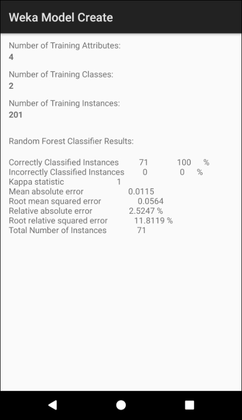

# Weka-Model-Create
This repository includes a the Weka model Creation app for Android. It is an Android Studio project which integrates a Weka library to handle the ML model creation.

This project is covered in detail in chapter 6 of the [book](https://www.apress.com/us/book/9781484239506):

# About the Project
The project includes the following 2 data files, derived from the Old Faithful Geyser clustering example in chapter 5, as part of the app's assets. 

Although we are including the data files directly in the project, the app could just as easily download these text files from the cloud using a network operation.

* **oldfaithful_train.arff** - A subset of the ARFF data file generated in the chapter 5 clustering example, contains the first 201 instances. 
* **oldfaithful_test.arf**f - A subset of the ARFF data file generated in chapter 5 clustering example, contains the last 71 instances of the dataset.

This Weka Model Create app will build a model from scratch, using the first file as the training data. Note that if wanted to implement the app with a single data file, we could use a filter to perform a split of the file. 

Note that Cross-fold validation is also possible using filters.

This app is technically a classification app. The Old Faithful data was originally a clustering problem, but recall when the DBSCAN algorithm completed the clustering operation; we saved the results, including the newly assigned clusterID to the new ARFF file. 

When we test the model, we use the known cluster assignments to determine the classifier accuracy.

# Project References

Project Name: **Weka Model Create**

Source: **WekaModelCreate.zip** or **github.com/wickapps/Weka-Model-Create**

Type: **Android Studio Project**

# Note: 

This Android app creates a Random Forest model, trains it with a training dataset, evaluates the classifier with a test dataset, and displays the results in a TextView.

# File Description

| File                             | Description                                                  |
| -------------------------------- | ------------------------------------------------------------ |
| app->libs->Weka-Android-3-8-1.jar	| The Weka jar file for Android generated from the Eclipse project. |
| app->src->main->java->MainActivity.java | The main java source code file. The project has a single activity. |
| app->src->main->res->layout->activity_main.xml | The layout file for the single screen display output. |
| app->src->main->res->raw->oldfaithful_train.arff | The training dataset, 201 instances in ARFF format. |
| app->src->main->res->raw->oldfaithful_test.arff | The test dataset, 71 instances in ARFF format. |
| app->src->main->res->AndroidManifest.xml | Manifest file. |

# Application Screenshot
